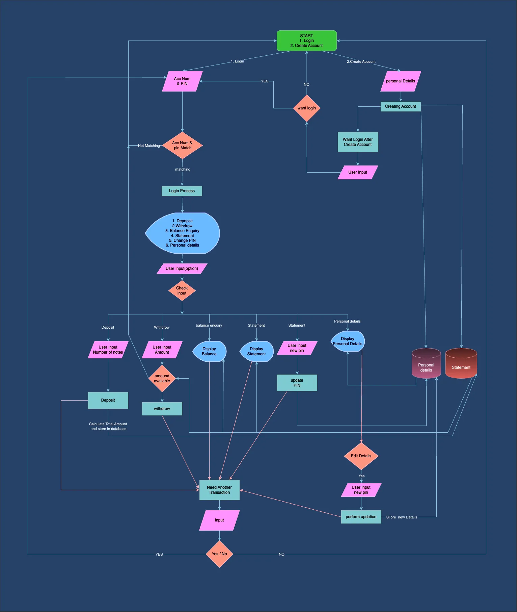

# ATM Automation

The live link can be found here - [ATM Automation](https://atm-automation-56428b57995b.herokuapp.com/)

The ATM Automation Project in Python is a testament to the power of automation in simplifying and enhancing the banking experience. It offers users a secure and efficient way to manage their accounts and perform financial transactions, reflecting the continuous evolution of technology in the banking industry. This project showcases the potential for Python to create versatile and user-friendly applications in the field of finance.

(Developer: Eby Chacko)

## Introduction

The ATM Automation Project in Python is a robust and user-friendly system designed to automate various functions of an Automated Teller Machine (ATM). This project leverages Python programming to create a virtual ATM system that mimics the functionality of a real-world ATM. It offers a secure and convenient way for users to perform banking transactions, check balances, withdraw cash, and more.

## Table of Contents

- [Project Goals](#project-goals)
- [User Experience](#user-experience)
- [Design](#design)
- [Features](#features)
- [Technologies](#technologies-used)
- [Testing](#testing)
- [Bugs](#bugs)
- [Deployment](#deployment)
- [Clone the Repository Code Locally](#clone-the-repository-code-locally)
- [Credits](#credits)

## Project Goals

The goal of the ATM Automation Project is to design, develop, and implement a comprehensive and efficient automated system for Automated Teller Machines (ATMs). This system aims to enhance the user experience, improve operational efficiency, and ensure the security of financial transactions for both customers and the financial institution.

- __User Goals__

  - Transaction Security: Implement robust security measures to safeguard customer data and financial transactions. This includes encryption, user authentication, and monitoring for any suspicious activity.

  - Cash Management: Optimize cash handling within the ATM, ensuring that it is always adequately stocked and balanced.

  - Transaction History: Maintain a transaction history for customers, allowing them to review their recent transactions and account balances.

  - Financial Insights: Users want to gain insights into their financial habits and patterns. They look for reports, charts, and visualizations that provide a clear overview of their income, expenses, and savings over time. These insights help them make more informed financial decisions.

- __Site Owner Goals__

  - User-Friendly Interface: Develop a user-friendly graphical interface that enables customers to easily conduct a wide range of banking transactions, including cash withdrawals, deposits, balance inquiries, fund transfers, and more.
  - Error Handling: Develop a robust error-handling system to address common transaction errors, ensuring a smooth and error-free user experience.
  - Cost Efficiency: Optimize the operational costs associated with ATM maintenance, security, and cash management.

  [Back to Table of Contents](#table-of-contents)

## User Experience

- __Target Audience__

  - Bank Customers: Individual account holders, both checking and savings account holders and Business account holders.
  - Small Business Owners: Small business owners who use ATMs for various financial transactions like cash deposits and withdrawals.

  The target users of an ATM automation project are diverse, encompassing a broad range of individuals and entities who rely on ATMs for their banking needs, whether it be for routine transactions, financial emergencies, or the sheer convenience of 24/7 access to banking services. The project aims to serve these users efficiently and securely, enhancing their overall banking experience.

- __User Stories__

As a customer approaching an Automated Teller Machine (ATM), the experience is designed to be user-centric, efficient, and secure. 

The user experience at the ATM is designed to be efficient, secure, and hassle-free. Whether you're conducting routine transactions or addressing unexpected financial needs, the ATM's user-friendly interface and thoughtful design aim to provide you with a seamless and satisfying banking experience.

[Back to Table of Contents](#table-of-contents)

## Design

- __Design Choices__

As this program was built for the terminal, there wasn't much in terms of design or colour. 

- __Type Writer Effect__

Since this system operates solely within a terminal environment, there are limited opportunities for complex visual design. To enhance the user experience, I've implemented a typewriter effect for text presentation on the screen. This effect is primarily used for headings and important results, ensuring a balance between engaging presentation and efficient use of time.

## Flowchart

A well-designed flowchart for an ATM software project helps developers, testers, and stakeholders understand the system's functionality, interactions, and decision points, ensuring the smooth operation of the ATM and a positive user experience. The flowchart is given below.

[Back to Table of Contents](#table-of-contents)

## Features

### Welcome screen
  

- In this ATM machine software project, there is a welcome screen that greets the customer and provides instructions on how to proceed with transactions. The welcome screen typically displays a welcoming message and offers two options: "Login" for existing customers and "Create Account" for new customers

   

### Create Account

  If the customer is a new user, they will find the "Create Account" option on the welcome screen. When this option is chosen, the customer is required to provide personal details, including their name, address, mobile number, and email, as part of the account creation process. Additionally, for security purposes, the ATM will collect the address proof.

The ATM system generates a unique account number for the new user, and the customer is given the freedom to choose their own personal identification number (PIN) to facilitate future transactions.

  

  After the account creation process is successfully completed, the system will display a confirmation message indicating the success of the process. It will also present the system-generated account number and the customer's chosen ATM PIN. Furthermore, the system will provide clear instructions for the customer to save these details for future transactions. This step ensures that the customer has the necessary information to access their account and conduct ATM transactions securely.

  After this message, the system give two options to the customer:

- Login: This option allows the customer to easily access their account and proceed with ATM transactions.
- Exit: If the customer chooses this option, they can exit the system without proceeding further.

These options provide the customer with the flexibility to either log in and use the ATM or exit the system as needed.

  

### Login

  If the user is an existing customer, they can log in using their account number and PIN, which they already possess. After successfully logging in, they can access and perform various options, including:

  

- Deposit: This option allows the customer to deposit funds into their account. When a customer selects the "Deposit" option, the ATM system initiates a process for cash deposit. Here's how it works:

1. The customer is prompted to enter the number of notes of each denomination they are depositing. The system will ask for the quantity of each note type 
 2. The ATM system calculates the total deposit amount by multiplying the quantity of each note by its denomination and then summing these values. This total amount is displayed for verification.
3. Upon confirmation of the total amount, the system updates the customer's account statement, recording the deposit amount, and date of the transaction.
4. A deposit confirmation is provided to the customer.

This process ensures that the customer's account is accurately credited with the deposited amount, and a record of the transaction is maintained in their account statement for future reference.

If the customer wishes to perform additional transactions after completing a deposit and receiving the confirmation, the system will provide them with the option to do so. Upon choosing to perform more transactions, the system will guide them back to the after-login page, allowing them to access the main menu where they can select and initiate another transaction or take any other desired action, ensuring a seamless and efficient banking experience.

- Withdraw: Customers can withdraw cash from their account. In the "Withdraw" section, the customer is instructed to enter the withdrawal amount in multiples of 5, as the ATM dispenses only notes, not coins. Here's how the process works:

    1. The customer inputs the desired withdrawal amount, ensuring that it is in 
    2. The ATM system checks whether the requested withdrawal amount is less than or equal to the available account balance.
    3. If the withdrawal amount is both in multiples of 5 and within the available balance, the system proceeds with the withdrawal.

        If the withdrawal amount is not in multiples of 5 or exceeds the available balance, the system displays a message: "Insufficient Balance" and shows the current account balance to inform the customer.

        Additionally, it provides the customer with the following options:

        1. Perform Another Transaction
        2. Exit

    

- Balance Enquiry: Customers can check the current balance in their account.

    When a customer selects the "Balance Enquiry" option, the ATM system retrieves the data from the database and displays the current account balance on the screen. Additionally, it provides the customer with the following options:
    1. Perform Another Transaction
    2. Exit

    

- Statement: This option provides access to account statements, showing recent transactions and account activity.

    Additionally, it provides the customer with the following options:
    1. Perform Another Transaction
    2. Exit 

    
- Change PIN: Customers can change their ATM PIN for security purposes.

    In the "Change PIN" option, the system follows these steps:
    1. The customer inputs their desired new PIN and confirm they need to update the PIN.
    2. The system processes the new PIN entry and updates the customer's stored PIN with the new one.
    3. After the PIN update is successful, the system displays a message confirming the change, such as "PIN Update Successful."
    4. Additionally, as always it provides the customer with the following options, but in this case the options is slightly changed to the following:
        1. Review details
        2. Exit 
        
    

- View Personal Details: This option allows customers to review and verify their personal information on record.

     the "View Personal Details" section, customers can access it from three main sections: the "After Login" page, the "Change PIN" section, and the "Edit Personal Details" section, which is a subsection of the personal details section in the "After Login" page. Here's how it works:

1. Access from the After Login Page:

    When accessing this section from the "After Login" page, the customer can view their personal details. The system retrieves all personal details from the database and displays them on the screen.
    After viewing their details, the system offers two options:
        
    - Edit Personal Details: If the customer wishes to update or modify any personal information, they can choose this option.
    - Exit: If the customer has finished viewing their details and wants to exit, they can select the "Exit" option.

2. Access from the Change PIN Section:

    Customers can access the "View Personal Details" section from the "Change PIN" section, as it is a related section within the ATM interface.
3. Access from the Edit Personal Details Section:

    This section can also be accessed directly from the "Edit Personal Details" subsection within the personal details section of the "After Login" page.

    In all three cases, the "View Personal Details" section provides customers with the ability to review their personal information, with options to edit details or exit the ATM interface as needed.

    

    - Update Personal Details :
    
        The option to edit personal details, as a sub-feature of the personal details section, provides customers with the ability to independently update their information. Customers can change their address, mobile number, or update their address proof as needed, enhancing their autonomy and ensuring that their personal information remains accurate and up-to-date. This feature adds convenience and flexibility to the ATM system, allowing customers to manage their account information seamlessly.

    

    ## Unimplemented Features

    Since this system is an ATM and primarily deals with cash transactions, security is of paramount importance. To enhance security, I initially attempted to encrypt the ATM PIN using the "bcrypt" module. However, I encountered an error, specifically the "invalid salt" error, despite multiple attempts to resolve it. Consequently, I made the decision to discontinue the use of this encryption method.
    
    The encryption process was functioning as intended. However, when verifying the PIN during the login process, an "invalid salt" error is being displayed.

    