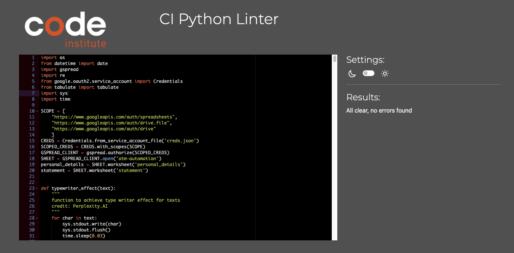

## Python Validation

I validated my file using [Code Institute's Python Linter](https://pep8ci.herokuapp.com/) and was met with no errors.

The Result is given below.

___

## Testing User Stories

Certainly, here are some user testing stories for the ATM automation project:

1. Account Creation Testing:

- As a new user, I want to test the account creation process.
- I will select the "Create Account" option and provide the required personal information.
- I expect the system to create a new account, generate an account number, and provide me with my chosen PIN.

2. User Login Testing:

- As a user, I want to test the login functionality to ensure that I can access my account with the correct account number and PIN.
- I will enter my account number and PIN and expect successful login.
- If I enter incorrect credentials, I want to confirm that the system provides an appropriate error message and gives me the chance to re-enter the information.

3. Cash Withdrawal Testing:

- As a user, I want to test the cash withdrawal feature to ensure that I can withdraw funds from my account.
- I will enter a valid withdrawal amount (in multiples of 5).
- I expect the transaction to be successful and to receive the cash amount.
- If I enter an invalid amount, I want to confirm that the system handles it correctly with the appropriate error messages.

4. Balance Enquiry Testing:

- As a user, I want to test the balance enquiry feature to check my account balance.
- I will select the balance enquiry option.
- I expect the system to display my current account balance accurately.

5. Transaction History Testing:

- As a user, I want to test the transaction history feature to view my recent transactions.
- I will select the transaction history option.
- I expect the system to display a list of my recent transactions with details like date, type, and amount.

6. Change PIN Testing:

- As a user, I want to test the PIN change feature to update my PIN.
- I will select the change PIN option and provide my new PIN.
- I expect the system to successfully update my PIN and confirm the change.

7. Edit Personal Details Testing:

- As a user, I want to test the edit personal details feature to update my address or mobile number.
- I will select the option to edit personal details, make the necessary changes, and confirm.
- I expect the system to update my details accurately and provide confirmation.

8. Data Validation Testing:

- As a user, I want to test the system's data validation to ensure that it handles incorrect inputs properly.
- I will intentionally provide incorrect data, such as an invalid atm pin or a non-multiple-of-5 withdrawal amount.
- I expect the system to reject these inputs and display appropriate error messages.

These user testing stories cover a range of scenarios to ensure that the ATM automation project is user-friendly, secure, and reliable. They help identify and address issues, validate functionality, and confirm a positive user experience.

___

## Manual Testing
___ 

**Section Tested**|**Input To Validate**|**Expected Outcome**|**Expected Outcome**|**Pass/Fail**
:-----:|:-----:|:-----:|:-----:|:-----:
Load welcome screen|No input|Showing a welcome text in the screen. additionally two option for login and create account|As expected|Pass
login/ create account menu|Input "6"|Load the welcome screen without displaying any error reports. This is essential because if someone enters incorrect information and leaves without logging in, the error message may persist on the screen. When a new customer arrives, it's important to present them with a clean and fresh welcome screen to ensure a seamless and error-free experience.|As expected|Pass
login/ create account menu|Input "1"|Login screen appears, receives the account number and PIN from the user|As expected|Pass
login/ create account menu|Input "2"|Let the customer to Create account by receiving the personal details|As expected|Pass
login Screen|Account Number : 111111 / PIN:0000|As the Account number and Pin were wrong, Showing an error repot "Account Number Not found". Also show the options for try again, Create Account or exit.|As expected|Pass
login Screen|Account Number : 100025 / PIN:0000|Showing an error report"Incorrect Pin" as only the Pin was wrong.  Also show the options for try again, Create Account or exit.|As expected|Pass
login Screen|Account Number : 100025 / PIN:1234|The login process done and show the After login page with the options of Deposit, Withdrawal, Balane Enquiry, Statement, Change Pin, personal details and exit.|As expected|Pass
After Login Screen|Input "9"|Show an error report "Invalid Option. Choose option from 1 to 7 only", and show the after login options again.|As expected|Pass
After Login Screen|Input "1"|Open the deposit screen and show the options to choose the notes to deposit.|As expected|Pass
After Login Screen|Input "2"|open the withdrawal screen and give a notice that "The machine do not give coin. Enter an amount multiple of 5 Euro". and accept input from the user.|As expected|Pass
After Login Screen|Input "3"|Show the Available Balance on the screen, Also give options to do more transaction or to exit.|As expected|Pass
After Login Screen|Input "4"|Show all the transactions on the screen  Also give options to do more transaction or to exit.|As expected|Pass
After Login Screen|Input "5"|open the change PIN screen and get input for the new PIN from the user.|As expected|Pass
After Login Screen|Input "6"|Showing all the personal details. and two options to edit the details and exit.|As expected|Pass
After Login Screen|Input "7"|Exit the login screen and load a fresh welcome screen.|As expected|Pass
Create Account screen|Name Input : blank String|Show error report "Name cannot be empty & Enter only alphabets and spaces"|As expected|Pass
Create Account screen|Name Input : 1234444|Show error report "Name cannot be empty & Enter only alphabets and spaces"|As expected|Pass
Create Account screen|Name Input : Eby|show the input option for the address|As expected|Pass
Create Account screen|Address Input : blank String|Show error report "address cannot be empty"|As expected|Pass
Create Account screen|Address Input : Apartment 2, ballinalsoe|show the input option for the Mobile Number|As expected|Pass
Create Account screen|Mobile Number Input : hello|Show error report "Invalid mobile number. Enter a 10-digit number"|As expected|Pass
Create Account screen|Mobile Number Input : -400022|Show error report "Invalid mobile number. Enter a 10-digit number"|As expected|Pass
Create Account screen|Mobile Number Input : 0892334291|show the input option for the EMAIL|As expected|Pass
Create Account screen|Email Input : 567655|Show error report "Invalid Email address"|As expected|Pass
Create Account screen|Email Input : eby@gmail.com|show the input option for the ATM pin|As expected|Pass
Create Account screen|Pin Input : 12|Show error report "Invalid PIN number. Enter a 4-digit number"|As expected|Pass
Create Account screen|Pin Input : -1234|Show error report "Invalid PIN number. Enter a 4-digit number"|As expected|Pass
Create Account screen|Pin Input : 0192|show the options for the Type of address proofs|As expected|Pass
Create Account screen|Input "5"|Show error report "Invalid option. Choose only 1,2 or 3."|As expected|Pass
Create Account screen|Input "2"|show the input option for the Address proof document number|As expected|Pass
Create Account screen|Document number Input : hello|Show error report "Invalid document number. Enter an 8-digit number"|As expected|Pass
Create Account screen|Document number Input : 08978675|Show a successful message along with the account number that is created by the system and the Pin choosen by the user. Additionally giving two options for login and exit|As expected|Pass
Account Created screen|Input "3"|Show error report "Invalid option. Choose only 1 or 2."|As expected|Pass
Account Created screen|Input "1"|Login Screen Appears|As expected|Pass
Account Created screen|Input "2"|Exit the screen and load a fresh welcome screen.|As expected|Pass
Deposit Screen|Input "1"|show the input option to enter the number of 500 euro notes|As expected|Pass
Deposit Screen|Input "2"|show the input option to enter the number of 200 euro notes|As expected|Pass
Deposit Screen|Input "3"|show the input option to enter the number of 100 euro notes|As expected|Pass
Deposit Screen|Input "4"|show the input option to enter the number of 50 euro notes|As expected|Pass
Deposit Screen|Input "5"|show the input option to enter the number of 20 euro notes|As expected|Pass
Deposit Screen|Input "6"|show the input option to enter the number of 10 euro notes|As expected|Pass
Deposit Screen|Input "7"|show the input option to enter the number of 5 euro notes|As expected|Pass
Deposit Screen|Input "8"|Show error report "You did not choose any note to deposit" if no notes were chosen. Else perform the deposit.|As expected|Pass
Deposit Screen|Input "9"|Exit the deposit screen and load the after login screen.|As expected|Pass
Deposit Screen|Input "10"|Exit the deposit screen and load a fresh welcome screen.|As expected|Pass
Number of notes Screen | Input "-5" | Show error report "Choose a positive number" |As expected|Pass
Confirm Notes Screen|Input "1"|When the customer choose 8 in the deposit screen, this screen appears with the number of notes and total amount calculated using the number of notes. Input "1" confirm the deposit process. and show the Confirmation of deposit and available balance after the deposit.|As expected|Pass
Confirm Notes Screen|Input "2"|Appears the deposit screen again to re enter the number of notes in case of any wrong entry.|As expected|Pass
Confirm Notes Screen|Input "3"|Show error report " Invalid option. Choose only 1 or 2."|As expected|Pass
Withdrawal Screen|Input "202"|Show error report "Invalid Amount"|As expected|Pass
Withdrawal Screen|Input "-200"|Show error report "Invalid Amount"|As expected|Pass
Withdrawal Screen|Input "200"|Transaction will process and show a message to collect the cash from the tray.|As expected|Pass
Change Pin Screen|Input "abcd"|Show error report "Invalid PIN number. Enter a 4-digit number"|As expected|Pass
Change Pin Screen|Input "2345"|Show option to confirm the updation. if press 1 Updation processes if choose 2 updation will cancel and go back to the after login page.|As expected|Pass
Personal details Screen|Input "1"|Open the screen for edit the personal details.|As expected|Pass
Personal details Screen|Input "2"|Exit the screen and load a fresh welcome screen.|As expected|Pass
Personal details Screen|Input "3"|Show error report " Invalid option. Choose only 1 or 2."|As expected|Pass
Update personal details Screen|Input "1"|show the input option for the name. and if the user confirm the input, system update the name.|As expected|Pass
Update personal details Screen|Input "2"|show the input option for the Address.and if the user confirm the input, system update the Address.|As expected|Pass
Update personal details Screen|Input "3"|show the input option for the Mobile Number.and if the user confirm the input, system update the Mobile number.|As expected|Pass
Update personal details Screen|Input "4"|show the input option for the Email.and if the user confirm the input, system update the Email.|As expected|Pass
Update personal details Screen|Input "5"|show the input option for the Address Proof. and if the user confirm the input, system update the Address proof.|As expected|Pass
Update personal details Screen|Input "6"|Exit the deposit screen and load the after login screen.|As expected|Pass
Update personal details Screen|Input "7"|Show error report " Invalid option. Choose only from 1 to 6"|As expected|Pass